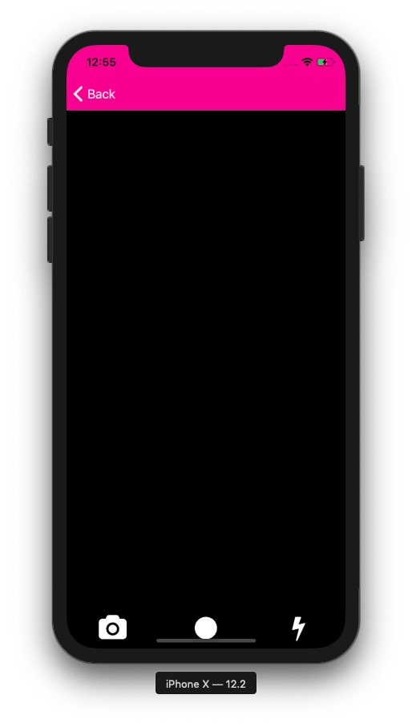

# ReactNative-CameraApp

```javascript
This is a simple react native app.
It asks for permission to access camera of the device and click picture.You can use front as well as back camera and can also use flashlight.

```



